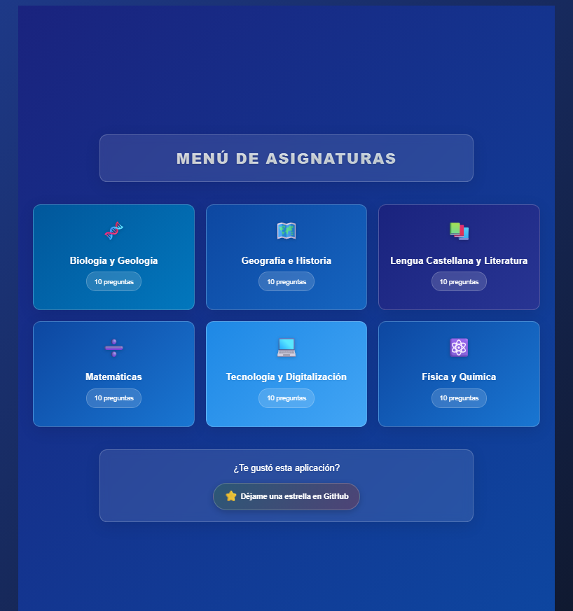
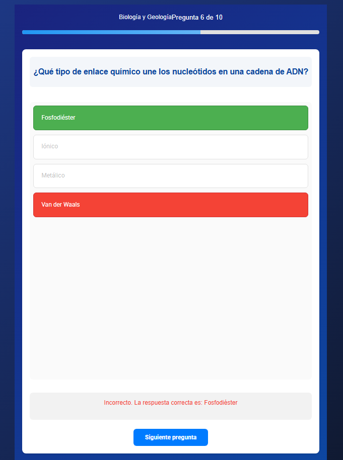
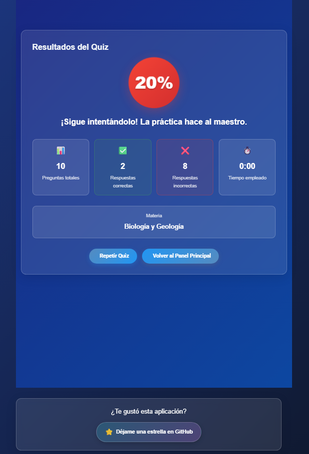

# Angular Quiz Engine
Angular Quiz Engine is a modern educational quiz application built with Angular 19. It is designed to assess academic knowledge across multiple subjects. The application features a responsive interface, smart scoring logic, immediate feedback, and test repetition capabilities.

It follows best practices in modular design and separation of concerns, making it highly maintainable and scalable. The UI is fully responsive across desktop and mobile devices, making it suitable for both schools and self-learners.

## Features
- Multi-subject quiz system covering six core academic areas

- Smart scoring engine with adaptive performance messages

- Integrated timer that tracks time per quiz session

- Immediate feedback with answer explanations

- Quiz repetition to reinforce learning

- Fully responsive layout for desktop, tablet, and mobile

### Main Screen


### Question Screen


### Results Screen


## Technologies
- Angular 19 with standalone components

- Angular Universal for server-side rendering (SSR)

- RxJS for reactive state management

- TypeScript with strict typing

- SCSS for styling and theme management

## Project Structure
```
src/
├── app/
│   ├── core/
│   │   ├── services/
│   │   │   ├── quiz.service.ts
│   │   │   ├── app-state.service.ts
│   │   │   ├── cache.service.ts
│   │   │   ├── analytics.service.ts
│   │   │   └── notification.service.ts
│   │   ├── interceptors/
│   │   │   └── error.interceptor.ts
│   │   └── core.module.ts
│   ├── features/
│   │   └── quiz/
│   │       ├── components/
│   │       │   ├── category-selector.component.*
│   │       │   ├── quiz-question.component.*
│   │       │   ├── quiz-results.component.*
│   │       │   └── quiz.component.*
│   │       └── quiz.module.ts
│   ├── models/
│   │   └── quiz.model.ts
│   ├── shared/
│   │   ├── components/
│   │   │   ├── error/
│   │   │   ├── loading/
│   │   │   └── notifications/
│   │   └── shared.module.ts
│   ├── app.component.*
│   ├── app.config.*
│   └── app.routes.*
├── assets/
│   └── data/
│       └── questions.json
├── environments/
│   ├── environment.ts
│   └── environment.prod.ts
└── styles.scss
```

## Prerequisites
- Node.js (v18 or higher)

- npm or yarn

- Angular CLI (v19 or higher)

## Installation

### 1. Clone the Repository
```bash
git clone https://github.com/your-username/angular-quiz-engine.git
```

### 2. Navigate to the project directory
```bash
cd angular-quiz-engine
```

### 3. Install dependencies
```bash
npm install
```

### 4. Run in development mode
```bash
ng serve
```

## Core Components

### CategorySelectorComponent
- Displays subject categories using visual cards. 

- Allows easy navigation between subjects.

### QuizQuestionComponent
- Displays questions and answer choices.

- Includes a progress bar and immediate feedback with color indicators.

- Allows navigation between questions.

### QuizResultsComponent
- Shows animated score and a summary of performance. 

- Displays correct/incorrect counts, time spent, and allows retaking the quiz.

## Core Services

### QuizService
Manages all quiz logic and state.

```ts
getQuizState(): Observable<QuizState>
getQuestions(category: string): Observable<QuizQuestion[]>
startNewQuiz(category: string): void
calculateResult(questions: QuizQuestion[]): QuizResult
selectAnswer(answer: string): void
resetQuiz(): void
```
### AppStateService
Manages application-level state and communication across components.

### CacheService
Caches questions to optimize performance during quizzes.

### AnalyticsService
Tracks user behavior and logs interactions.

### NotificationService
Displays toast messages and system alerts.

## Quiz State Structure
```ts
interface QuizState {
  isComplete: boolean
  currentQuestionIndex: number
  selectedAnswers: string[]
  timeSpent: number
  category: string
  score: number
  questions: QuizQuestion[]
}
```

## Subjects
| Subject                        | Questions | Description                               |
|--------------------------------|-----------|-------------------------------------------|
| Biology & Geology             | 10        | DNA, mitosis, evolution, geology           |
| Geography & History           | 10        | World history, physical geography          |
| Spanish Language & Literature | 10        | Spanish literature, advanced syntax        |
| Mathematics                   | 10        | Algebra, calculus, geometry                |
| Technology & Digitalization   | 10        | Programming, AI, blockchain, cloud         |
| Physics & Chemistry           | 10        | Quantum mechanics, chemical bonds          |

## Scoring System
- Excellent (90–100%) – "Excellent work! You're an expert in this subject."

- Good (70–89%) – "Great job! You have strong command of the topic."

- Fair (50–69%) – "Not bad! Keep practicing to improve."

- Needs Improvement (<50%) – "Keep trying! Practice makes perfect."

## Layout Grid
- Desktop: 3-column

- Tablet: 2-column

- Mobile: 1-column with touch support

## Linting and Formatting
```bash
# Check code quality
ng lint

# Format code using Prettier
npx prettier --write "src/**/*.{ts,html,scss}"
```

## Deployment
Build for Production
```bash
# Optimized production build
npm run build

# Output will be in dist/angular-quiz-engine/
```

## Environment Variables
```ts
// environment.prod.ts
export const environment = {
  production: true,
  apiUrl: 'https://your-api.com',
  version: '1.0.0'
};
```

## Contribution Guide
1. Fork the project  
2. Create a branch for your feature (`git checkout -b feature/AmazingFeature`)  
3. Commit your changes (`git commit -m 'Add some AmazingFeature'`)  
4. Push to the branch (`git push origin feature/AmazingFeature`)  
5. Open a Pull Request  

## License
MIT License

Permission is hereby granted, free of charge, to any person obtaining a copy of this software and associated documentation files (the "Software"), to deal in the Software without restriction, including without limitation the rights to use, copy, modify, merge, publish, distribute, sublicense, and/or sell copies of the Software, and to permit persons to whom the Software is furnished to do so, subject to the following conditions:

The above copyright notice and this permission notice shall be included in all copies or substantial portions of the Software.

THE SOFTWARE IS PROVIDED "AS IS", WITHOUT WARRANTY OF ANY KIND, EXPRESS OR IMPLIED, INCLUDING BUT NOT LIMITED TO THE WARRANTIES OF MERCHANTABILITY, FITNESS FOR A PARTICULAR PURPOSE AND NONINFRINGEMENT. IN NO EVENT SHALL THE AUTHORS OR COPYRIGHT HOLDERS BE LIABLE FOR ANY CLAIM, DAMAGES OR OTHER LIABILITY, WHETHER IN AN ACTION OF CONTRACT, TORT OR OTHERWISE, ARISING FROM, OUT OF OR IN CONNECTION WITH THE SOFTWARE OR THE USE OR OTHER DEALINGS IN THE SOFTWARE.
